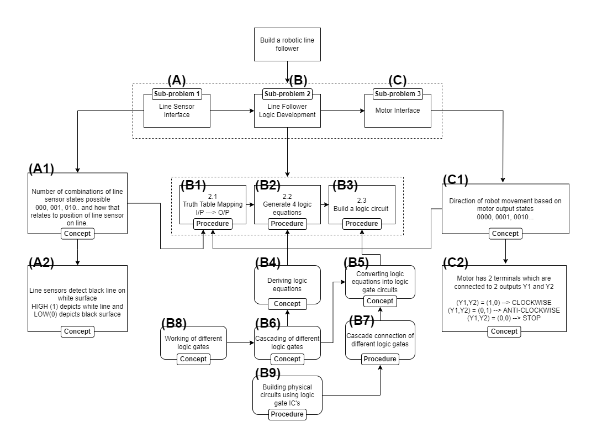

<h1>Logic AR</h1>
<h2>AR-application to teach digital electronics</h2>
  

 ### **Overview**

**LogicAR** is a an augmented reality application developed to teach basic digital electronics concepts to engineering undergraduate students. The goal of this application was to address two teaching-learning problems - 
- ***Bridging the gap between theory and practice***
- ***Development of Representational Competence***.

### **Solution Approach**
To address the above mentioned teaching-learning problems, the following affordances of AR have been taken into consideration.
1. Dynamic Visualization to enhance conceptual understanding
2. Drawing the connection between theory and practice by facilitating an
experimentation-based approach.

For designing the activities in the application, a top-down approach was chosen. An initially complex problem statement that the students would learn how to implement. This problem statement is then broken down into smaller sub-problems which are then further classified into **concepts** and **procedures**. Based on this a **Problem Map** is created and AR-based learning activities are designed for selected concepts and procedures.

 Figure 1: Problem Map 

The activities in the LogicAR application were divided into 4 Levels - L1, L2, L3,
and L4 in the order of increasing complexity. The 4 levels of LogicAR have been explained below:

1. **L1 (Basic Logic Gates)** - The activities in this level discuss the three basic logic
gates - NOT, AND and OR. Students are guided
through various activities which show the working of
the three basic logic gates and their different
representations like logic circuits, truth tables and
logic gate circuits.    Students also learn how to build logic gate circuits for
the basic gates using logic gate IC’s like 7404 (NOT),
7408 (AND) and 7432 (OR) and other physical
hardware components such as breadboard, push
button, LEDs and resistors.

2. **L2 (L2 Cascading Logic Gates)** -  The activities in this level help students learn how to cascade the basic logic gates to build more complex logic circuits such as NAND and XOR gate circuits.    The AR-based activities in this level are drag-and-dropactivities in which students are required to complete connections between logic gates according to given logic circuits.

3. **L3 (Problem Statement Introduction)** - The activities in this level introduce students to the basic components of line follower and their functioning such as Line Sensor which distinguishes between white and black surface and DC motor actuator which help in robot locomotion.

4. **L4 (Problem Statement Implementation)** - The activities in this level help the students develop the logic for line follower robot. The consist of a series of activities related to the motion of the robot and how the robot should move according to the different line sensor outputs.

### **Application Demo**

Click on the below thumbnail images to view the application demo video on youtube.

 <b> L1 NOT Gate Demo</b>

 <b> L1 AND Gate Demo</b>

 <b> L1 OR Gate Demo</b>

 <b> L2 Activities Demo</b>

 <b> L3 Activities Demo</b>

### More Details

For detailed study design and research study discussion please refer my 

